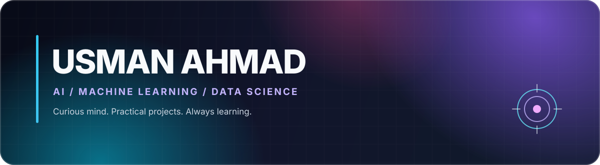

## 👋 About me

Computer Science graduate from **FAST-NUCES**, interested in the space where code, data, and useful ideas meet. I learn by building practical projects in **AI, machine learning, and data science**.

🎓 **BS Computer Science · FAST-NUCES** &nbsp; ✦ &nbsp; 🤝 **Open to AI/ML collaboration** &nbsp; ✦ &nbsp; 💌 **[Email me](mailto:usmanahmadjj97@gmail.com)**

## 🧰 My toolkit

### Languages

### AI, machine learning & notebooks

### Tools & platforms

<b>🧪 Current learning focus</b>

 

`NLP` · `Deep Learning` · `Computer Vision` · `Predictive Modeling` · `Data Engineering`

I’m especially interested in turning real-world data into clear, useful decisions. I value careful evaluation, understandable models, and projects built around a concrete problem.

## 🚀 Featured project

**Retention Risk Intelligence** — an end-to-end telecom churn prediction project. It compares four models using leakage-safe pipelines and five-fold cross-validation, selects Logistic Regression, and groups customers into high, medium, and low-risk segments.

## 📡 GitHub activity

### Let’s make something useful.

